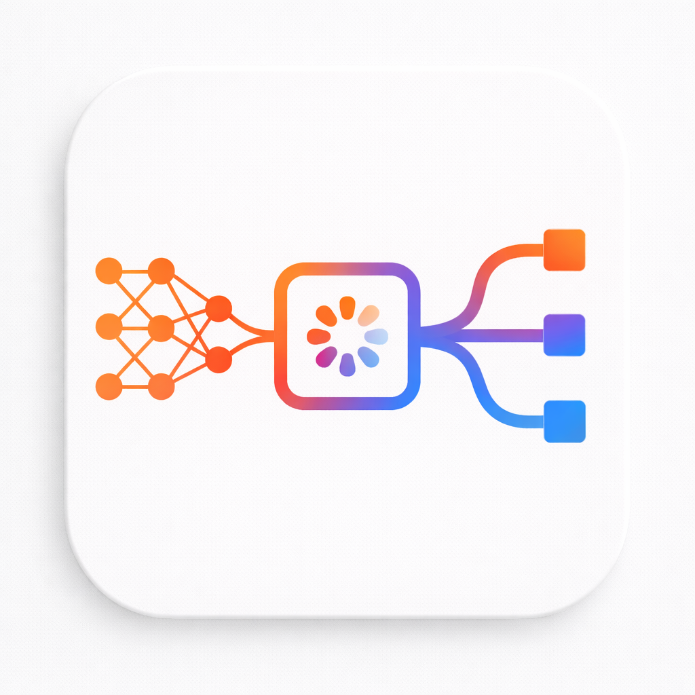
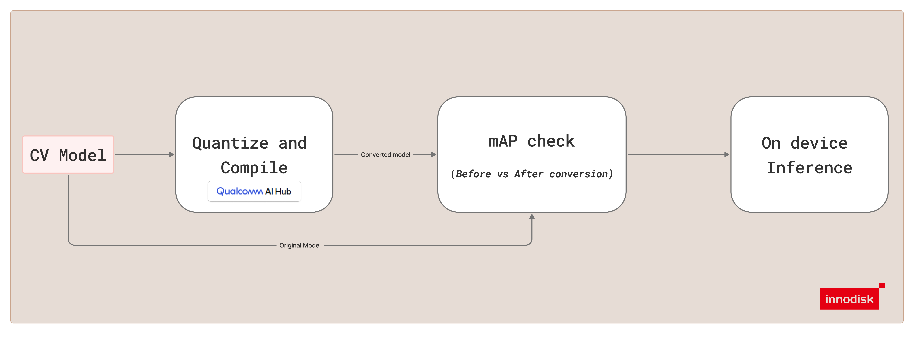
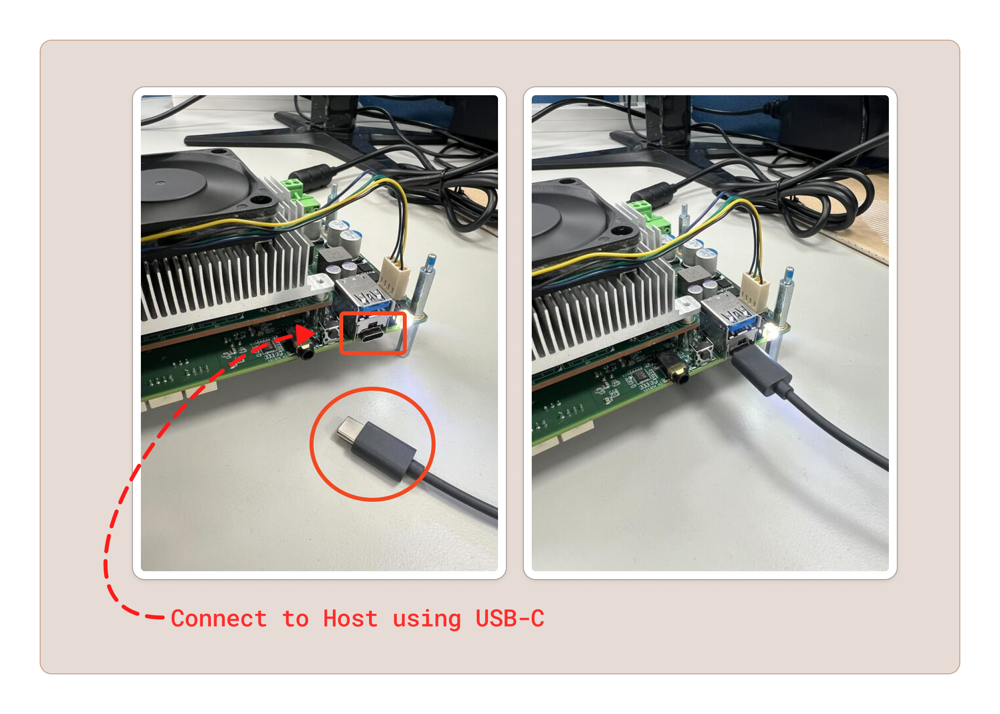

# iQ-Foundry

<br />
<div align="center"></div>
<br />

<h1 align="center"><em><strong>Simplify the Workflow, Accelerate Deployment.</strong></em></h1>

<h3 align="center">This tool simplifies model quantization and validation for edge AI, reducing friction from preparation to real-device deployment—making workflows repeatable and scalable.</h3>



`iQ-Foundry` helps prepare computer vision models for innodisk Qualcomm solution. The current workflow supports compiling compatible YOLO.ptmodels into.tflite artifacts, validating FP-versus-quantized quality with mAP@0.5, and running on-device inference on [EXMP-Q911 (Qualcomm QCS9075)](https://www.innodisk.com/en/products/computing/qualcomm-solution/exec-q911).

## Requirements

### Host Requirements

- Ubuntu 22.04
- Recommended minimum 16 GB RAM

### Target Requirements

- EXMP-Q911 (Qualcomm QCS9075)

## Workflow Overview

`iQ-Foundry` is designed to move a supported YOLO model through quantization, validation, and on-device inference on EXMP-Q911 (Qualcomm QCS9075).

Use the repository in this order:

1. Set up the x86 host environment.
2. Connect the host to the EXMP-Q911 (Qualcomm QCS9075) target.
3. Set up the target environment.
4. Run `qc` on the host to generate a quantized `.tflite` model.
5. Run `mAP` to compare FP vs quantized model quality.
6. Run `test` for on-device inference.

Runtime behavior is split between host and target:

- `qc` runs on the x86 host.
- `mAP` runs FP evaluation on the host and quantized model evaluation on EXMP-Q911 (Qualcomm QCS9075) through ADB.
- `test` runs either from the host through ADB or directly on EXMP-Q911 (Qualcomm QCS9075) without ADB.

## Supported Models and Modes

| Category | Supported Values | Notes |
| --- | --- | --- |
| CLI model types | `yolov10`, `yolov11`, `yolov26` | Pass these values to `--type`. |
| Modes | `qc`, `mAP`, `test` | All modes are exposed through `cli.py`. |
| Devices | `EXMP-Q911 (Qualcomm QCS9075)` | Target platform supported by this workflow. |
| Runtime | `tflite` | TensorFlow Lite runtime is supported. |

## Getting Started

### STEP 1: x86 Host Setup

Clone the repository on the host:

```bash
git clone https://github.com/InnoIPA/iQ-Foundry.git
cd iQ-Foundry
pwd
```

Confirm that your working directory ends with `iQ-Foundry`. If not, change into the repository directory before continuing.

Install `uv` if it is not already available:

```bash
curl -LsSf https://astral.sh/uv/install.sh | sh
```

Create a virtual environment and install host dependencies:

```bash
uv venv .venv
source .venv/bin/activate
uv pip install -r requirements/host.txt
```

Authenticate with QAI Hub before running `qc`:

```bash
qai-hub configure --api_token <YOUR_QAI_HUB_API_KEY>
```

Use your QAI Hub API key when prompted.

### STEP 2: Connect Host to Target

`mAP` uses ADB because quantized model evaluation runs on EXMP-Q911 (Qualcomm QCS9075). `test` supports both ADB-based execution from the host and direct execution on the target.

#### Connect the Target with USB-C

Connect the EXMP-Q911 (Qualcomm QCS9075) target to the host machine using a USB-C cable before installing the host-side USB and ADB tools.

<p align="center">
  
</p>

#### Install ADB

Install ADB on the Ubuntu 22.04 host:

```bash
sudo apt update
sudo apt install adb
```

Verify that the target is visible over ADB:

```bash
adb devices
```

### STEP 3: Target Setup (Required only for on device inference without adb)

Set up the runtime environment on EXMP-Q911 (Qualcomm QCS9075). This can be done directly on the target, or after copying or cloning the repository onto the target.

```bash
git clone https://github.com/InnoIPA/iQ-Foundry.git
cd iQ-Foundry
pwd
```

Confirm that your working directory ends with `iQ-Foundry`.

Install `uv` if it is not already available:

```bash
curl -LsSf https://astral.sh/uv/install.sh | sh
```

Create the target virtual environment and install target dependencies:

```bash
uv venv --system-site-packages .venv
source .venv/bin/activate
uv pip install -r requirements/target.txt
```

`requirements/target.txt` is intended for EXMP-Q911 (Qualcomm QCS9075) runtime use only.

## Basic Run Commands

The examples below use `yolov26`. The same workflow also supports `yolov10` and `yolov11` by changing `--type` and supplying the matching model files.

### QC Mode

Use `qc` to quantize and compile a supported FP `.pt` model into a quantized tflite `.tflite` model through QAI Hub.

```bash
python3 cli.py \
  --mode qc \
  --type yolov26 \
  --model /path/to/yolov26n.pt \
  --calib_dir /path/to/calibration_images
```

By default, this writes the compiled model to `out/model/yolov26/yolov26_<quant>_<timestamp>.tflite`.

For advanced `qc` options, see [docs/qc_mode.md](docs/qc_mode.md).

### mAP Mode

Use `mAP` to compare FP vs quantized model quality at mAP@0.5. The FP model runs on the host, and the quantized model runs on EXMP-Q911 (Qualcomm QCS9075) through ADB.

```bash
python3 cli.py \
  --mode mAP \
  --type yolov26 \
  --annotations /path/to/instances_val2017.json \
  --images /path/to/val2017 \
  --fp-model /path/to/yolov26n.pt \
  --int-model /path/to/yolov26_int8.tflite
```

`--annotations` can be either a COCO `.json` file or a custom annotation
directory containing separate YOLO `.txt` labels or VOC `.xml` labels for each image in the images directory.

By default, this writes the report to `out/mAP_results/yolov26/yolov26_mAP_result_<timestamp>.txt`.

For advanced `mAP` options, see [docs/mAP_mode.md](docs/mAP_mode.md).

### Test Mode

Use `test` to run quantized model inference on EXMP-Q911 (Qualcomm QCS9075). The example below runs from the host through ADB.

```bash
python3 cli.py \
  --mode test \
  --type yolov26 \
  --model /path/to/yolov26_int8.tflite \
  --yaml /path/to/coco.yaml \
  --images /path/to/test_images \
  --adb
```

By default, this writes annotated images, detection `.txt` files, and `classes.txt` to `out/test/yolov26/yolov26_inference_<timestamp>/`.

For advanced `test` options, see [docs/test_mode.md](docs/test_mode.md).

## Advanced Mode Details

Use the mode documents for advanced options and mode-specific notes:

- [docs/qc_mode.md](docs/qc_mode.md)
- [docs/mAP_mode.md](docs/mAP_mode.md)
- [docs/test_mode.md](docs/test_mode.md)

## License

This project is licensed under the Apache License 2.0. See the `LICENSE` file for details.
