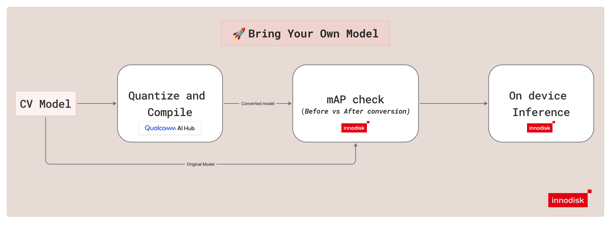

# iQ-Foundry

<br />
<div align="center"></div>
<br />

<h1 align="center"><em><strong>Simplify the Workflow, Accelerate Deployment.</strong></em></h1>

<h3 align="center">This tool simplifies model quantization and validation for edge AI, reducing friction from preparation to real-device deployment—making workflows repeatable and scalable.</h3>
<h3 align="center"><strong>🚀 Bring Your Own Model</strong></h3>
<p align="center"><i>Supports custom-trained and pretrained models.</i></p>



`iQ-Foundry` helps prepare computer vision models for innodisk Qualcomm solution. The current workflow supports compiling compatible computer vision `.pt` models into `.tflite` artifacts, validating FP-versus-quantized quality with mAP@0.5, and running on-device inference on [EXMP-Q911 (Qualcomm QCS9075)](https://www.innodisk.com/en/products/computing/qualcomm-solution/exec-q911).

`iQ-Foundry` supports a Bring Your Own Model workflow. You can use your own compatible `yolov10`, `yolov11`, or `yolov26` `.pt` models with the pipeline. If you need pretrained YOLO weights, you can download official pretrained models from [Ultralytics](https://docs.ultralytics.com/).

> **Note:** `iQ-Foundry` is focused on computer vision model conversion, optimization, and deployment. For broader workflows, additional features, and expanded setup options, see [iQ-Studio](https://github.com/InnoIPA/iQ-Studio/tree/main).

## Requirements

> 💡 **Notice:** The software version requirements must strictly follow the versions specified in requirements.txt. Please refer to [requirements host](./requirements/host.txt) and [requirements target](./requirements/target.txt).

### Host Requirements

- Ubuntu 22.04
- Recommended minimum 16 GB RAM

### Target Requirements

- EXMP-Q911 (Qualcomm QCS9075)

## Workflow Overview

`iQ-Foundry` is designed to move a supported computer vision model through quantization, validation, and on-device inference on EXMP-Q911 (Qualcomm QCS9075).

Use the repository in this order:

1. Connect the host to the EXMP-Q911 (Qualcomm QCS9075) target.
2. Clone the repository and set up the host environment.
3. Authenticate with Qualcomm AI Hub on the host.
4. Set up the target environment for direct on-device inference when needed.
5. Run `qc` on the host to generate a quantized `.tflite` model.
6. Run `mAP` to compare FP vs quantized model quality.
7. Run `test` for on-device inference.


Runtime behavior is split between host and target:

- `qc` runs on the x86 host.
- `mAP` runs FP evaluation on the host and quantized model evaluation on EXMP-Q911 (Qualcomm QCS9075) through ADB.
- `test` runs either from the host through ADB or directly on EXMP-Q911 (Qualcomm QCS9075) without ADB.

## Supported Models and Modes

| Category | Supported Values | Notes |
| --- | --- | --- |
| Model input formats | `.pt` | PyTorch `.pt` models are supported as input to this workflow. |
| CLI model types | `yolov10`, `yolov11`, `yolov26` | Pass these values to `--type`. |
| Modes | `qc`, `mAP`, `test` | All modes are exposed through `cli.py`. |
| Devices | `EXMP-Q911 (Qualcomm QCS9075)` | Target platform supported by this workflow. |
| Runtime | `tflite` | TensorFlow Lite runtime is supported. |

## Getting Started

### STEP 1: Connect Device

Connect the EXMP-Q911 (Qualcomm QCS9075) target to the host with a USB-C cable.

<p align="center">
  
</p>

ADB is used for `mAP` and for host-side `test` runs. For general ADB background, see [adb overview](https://developer.android.com/tools/adb).

### STEP 2: Clone the Repository and Set Up the Environment

Clone the repository on the host, enter the repository directory, and source the setup script:

```bash
git clone https://github.com/InnoIPA/iQ-Foundry.git
cd iQ-Foundry
source setup.sh
```

`setup.sh` prepares the Python environment, installs the required host packages, and checks ADB access.

### STEP 3: Authenticate with Qualcomm AI Hub

Log in to the [Qualcomm AI Hub Workbench](https://aihub.qualcomm.com/).

Navigate to `Account -> Settings -> API Token` to find your unique API token.

Configure the host with your API token:

```bash
qai-hub configure --api_token <YOUR_QAI_HUB_API_KEY>
```

### STEP 4: Target Setup (Required only for on device inference without adb)

Set up the runtime environment on EXMP-Q911 (Qualcomm QCS9075). This can be done directly on the target, or after copying or cloning the repository onto the target.

```bash
git clone https://github.com/InnoIPA/iQ-Foundry.git
cd iQ-Foundry
pwd
```

Confirm that your working directory ends with `iQ-Foundry`.

Install [uv](https://docs.astral.sh/uv/) if it is not already available:

```bash
curl -LsSf https://astral.sh/uv/install.sh | sh
```

Create the target virtual environment and install target dependencies:

```bash
uv venv --system-site-packages .venv
source .venv/bin/activate
uv pip install -r requirements/target.txt
```

`requirements/target.txt` is intended for EXMP-Q911 (Qualcomm QCS9075) runtime use only.

## Quick Start

`iQ-Foundry` supports two ways to run each mode:

- [Configure Flow Commands](./README.md#configure-flow-commands): simple, basic commands for each mode. Save the required paths in `config.json`, then run the mode with minimal options.
  For a simpler step-by-step walkthrough of configure flow, see the [iQ-Studio tutorial for YOLO26](https://github.com/InnoIPA/iQ-Studio/blob/main/tutorials/model-deploy/cv/yolo26/README.md).
- [Direct Run Commands](./README.md#direct-run-commands): full CLI usage with more supported flags. Pass the required paths and any extra options directly in the command.

Use configure flow when you want an easier repeated workflow. Use direct run commands when you need more control over paths and flags for a specific run.

## Configure Flow Commands

Configure flow lets you save the required paths in `config.json` and run each mode later with minimal options.

If you want a simpler guided setup for configure flow, start with the [iQ-Studio](https://github.com/InnoIPA/iQ-Studio/tree/main) tutorial: [YOLO26 Configure Flow Tutorial](https://github.com/InnoIPA/iQ-Studio/blob/main/tutorials/model-deploy/cv/yolo26/README.md).

The examples below use `yolov26`. You can also use `--type yolov10` or `--type yolov11`.

### QC

Use `qc` to quantize and compile a supported FP `.pt` model into a quantized tflite `.tflite` model through QAI Hub.

Configure the required paths: FP model path and calibration image directory.

```bash
python3 cli.py --type yolov26 --configure qc
```

Run the mode:

```bash
python3 cli.py --type yolov26 --mode qc
```

Output location: `out/model/yolov26/yolov26_<quant>_<timestamp>.tflite`

### mAP

Use `mAP` to compare FP vs quantized model quality at mAP@0.5. The FP model runs on the host, and the quantized model runs on EXMP-Q911 (Qualcomm QCS9075) through ADB.

Configure the required paths: annotations, input images, FP model, and INT8 model.

```bash
python3 cli.py --type yolov26 --configure mAP
```

Run the mode:

```bash
python3 cli.py --type yolov26 --mode mAP
```

For a smaller validation run, you can limit the number of images:

```bash
python3 cli.py --type yolov26 --mode mAP --max-images 5
```

Output location: `out/mAP_results/yolov26/yolov26_mAP_result_<timestamp>.txt`

### Test

Use `test` to run quantized model inference on EXMP-Q911 (Qualcomm QCS9075).

Configure the required paths: INT8 model, YAML file, and image directory.

```bash
python3 cli.py --type yolov26 --configure test
```

Run the mode:

```bash
python3 cli.py --type yolov26 --mode test
```

Output location: `out/test/yolov26/yolov26_inference_<timestamp>/`

> Note: `test` in configure flow commands supports ADB inference only. Direct on-device inference is not supported in configure flow.

> 💡 Tip: To review the currently saved mode paths, run `python3 cli.py --configure`, 

## Direct Run Commands

The examples below use `yolov26`. The same workflow also supports `yolov10` and `yolov11` by changing `--type` and supplying the matching model files directly on the command line.

### QC Mode

Use `qc` to quantize and compile a supported FP `.pt` model into a quantized tflite `.tflite` model through QAI Hub.

```bash
python3 cli.py \
  --mode qc \
  --type yolov26 \
  --model /path/to/yolov26n.pt \
  --calib_dir /path/to/calibration_images
```

By default, this writes the compiled model to `out/model/yolov26/yolov26_<quant>_<timestamp>.tflite`.

For advanced `qc` options, see [./docs/qc_mode.md](./docs/qc_mode.md).

### mAP Mode

Use `mAP` to compare FP vs quantized model quality at mAP@0.5. The FP model runs on the host, and the quantized model runs on EXMP-Q911 (Qualcomm QCS9075) through ADB.

```bash
python3 cli.py \
  --mode mAP \
  --type yolov26 \
  --annotations /path/to/instances_val2017.json \
  --images /path/to/val2017 \
  --fp-model /path/to/yolov26n.pt \
  --int-model /path/to/yolov26_int8.tflite
```

`--annotations` can be either a COCO `.json` file or a custom annotation
directory containing separate YOLO `.txt` labels or VOC `.xml` labels for each image in the images directory.

By default, this writes the report to `out/mAP_results/yolov26/yolov26_mAP_result_<timestamp>.txt`.

For `yolov10` and `yolov26`, if the INT8 model was generated with `--qc-head one2one`, run `mAP` with `--fp-head one2one` so the FP branch matches the compiled model.

For advanced `mAP` options, see [./docs/mAP_mode.md](./docs/mAP_mode.md).

### Test Mode

Use `test` to run quantized model inference on EXMP-Q911 (Qualcomm QCS9075). The example below runs from the host through ADB.

```bash
python3 cli.py \
  --mode test \
  --type yolov26 \
  --model /path/to/yolov26_int8.tflite \
  --yaml /path/to/coco.yaml \
  --images /path/to/test_images \
  --adb
```

By default, this writes annotated images, detection `.txt` files, and `classes.txt` to `out/test/yolov26/yolov26_inference_<timestamp>/`.

Use `--output` to override the default test output directory.

For advanced `test` options, see [./docs/test_mode.md](./docs/test_mode.md).

## Advanced Mode Details

Use the mode documents for advanced options and mode-specific notes:

- [./docs/qc_mode.md](./docs/qc_mode.md)
- [./docs/mAP_mode.md](./docs/mAP_mode.md)
- [./docs/test_mode.md](./docs/test_mode.md)

## Changelog

For release notes and documentation updates, see [./docs/changelog.md](./docs/changelog.md).

## License

This project is licensed under the Apache License 2.0. See the `LICENSE` file for details.
