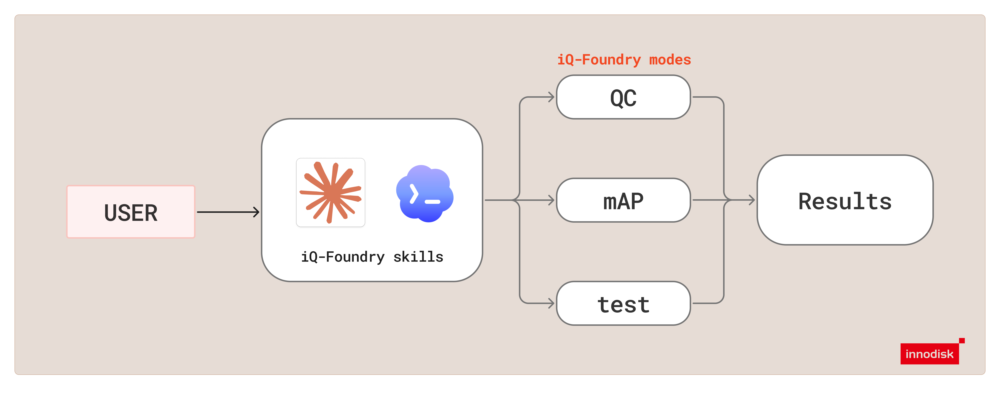

# iQ-Foundry Assistant

The **iQ-Foundry Assistant** is an agent skill, `iqf-assistant`, that lets you use iQ-Foundry by
chatting with a coding agent. You do not need to type commands. The assistant:

- checks your setup;
- asks a few simple questions;
- runs `qc`, `mAP` or `test`;
- tells you where the results are.



> [!NOTE]
> The skill has been tested with **Claude Code** and **Codex**.

## Before You Start

1. **Set up your host first.** Follow [Ubuntu_host.md](../Ubuntu_host.md) or
   [Windows_host.md](../Windows_host.md).
2. Connect the EXMP-Q911 board over USB-C. You need the board for `mAP` and `test`.
3. Open your coding agent (Claude Code, Codex or any other) in the iQ-Foundry folder.

> [!IMPORTANT]
> On Windows, start the agent inside the **WSL Ubuntu** terminal, in the iQ-Foundry folder. The
> Claude Code skill entry is a symlink, and a native Windows checkout does not expose it.

## Start the Assistant

In your coding agent, type:

```text
/iqf-assistant
```

Or just ask in plain words, or name the skill, for example:

```text
Use the iqf-assistant skill to convert my model.
```

When the agent asks, approve the commands that use Docker, USB or the internet. Codex's sandbox
blocks them by default.

## What Happens

1. **Setup check.** You get a ✅ / ❌ checklist. If something is missing, the assistant explains
   how to fix it. It never installs anything for you.
2. **Choose what to do.** The options are:
   - convert a model (`qc`);
   - check accuracy (`mAP`);
   - try a model on pictures (`test`);
   - all three.

   Then pick the runtime and precision.
3. **Give your files.** These are the model, pictures and labels. The assistant checks every
   path.
4. **Label check (mAP only).** If your labels are not in a format iQ-Foundry reads, the assistant
   tells you and makes a reformatted **copy**. Examples are YOLO sub-folders, LabelMe, CVAT, or a
   different class order. Your original files are never changed.
5. **Run and report.** You confirm, the mode runs, and the assistant explains the result and
   where to find it.

## Example Prompts

```text
Check if my computer is set up for iQ-Foundry.
```

```text
Convert my model /home/me/models/yolo26n.pt to litert int8 using the pictures in /home/me/calib.
```

```text
Check the accuracy of my converted model. My labelled pictures are in /home/me/dataset.
```

## Where Results Go

| What | Folder |
| --- | --- |
| Converted models (`qc`) | `out/model/<type>/` |
| Accuracy results (`mAP`) | `out/mAP_results/<type>/` |
| Pictures with detections (`test`) | `out/test/<type>/` |
| Reformatted mAP data, class-name files, run logs | `out/iqf-assistant/` |

## Good to Know

- **Your QAI Hub token stays private.** The assistant recommends that you log in yourself in your
  own terminal, where the token is typed hidden, so it never goes through the chat. It never asks
  for passwords and never shows your token.
- The assistant runs one mode at a time.
- It does not change iQ-Foundry's code or your saved `./docker/iqf configure` paths.
- For advanced options, see [qc_mode.md](qc_mode.md), [mAP_mode.md](mAP_mode.md) and
  [test_mode.md](test_mode.md).
