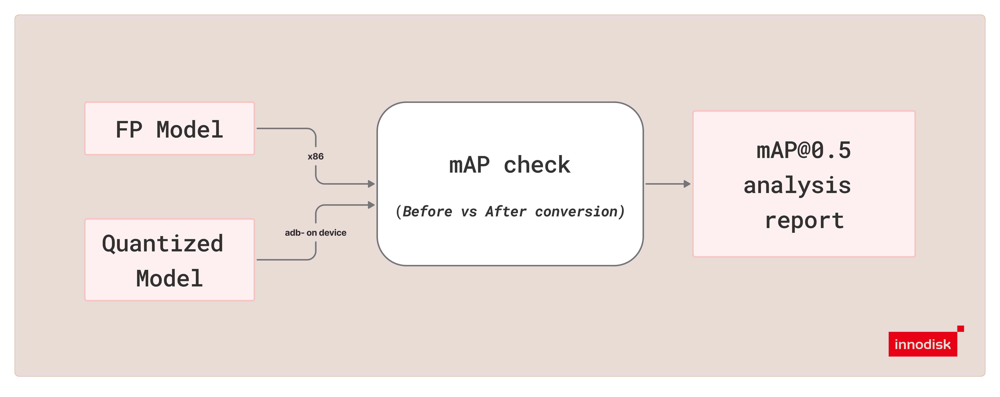

# mAP Mode

`mAP` mode compares an FP YOLO model against its compiled TFLite counterpart and reports the mAP@0.5 difference between the two. Use this mode to validate whether the compiled model preserves the expected detection quality before moving to device inference or broader testing.



## Basic Command

Use the command below as the starting point for `yolov26`:

```bash
python3 cli.py \
  --mode mAP \
  --type yolov26 \
  --annotations /path/to/instances_val2017.json \
  --images /path/to/val2017 \
  --fp-model /path/to/yolov26n.pt \
  --int-model /path/to/yolov26_compiled.tflite
```

`--annotations` accepts either a COCO `.json` file or a directory of custom labels.
For custom datasets, point `--annotations` at the label directory and `--images` at
the matching image directory.

## Purpose

`mAP` mode is used to answer one question: how much model quality changed after the compiled model was produced.

In the current implementation:

- the FP model runs on the host
- the compiled TFLite model runs on EXMP-Q911 (Qualcomm QCS9075) through ADB
- the tool evaluates both outputs with the same dataset, postprocess thresholds, and mAP@0.5 metric
- the final report shows FP mAP, compiled-model mAP, absolute delta, percentage delta, and the trend

## Required Inputs

`mAP` requires the following inputs:

- `--mode mAP`
- `--type` with one of `yolov10`, `yolov11`, or `yolov26`
- `--annotations` pointing to either a COCO annotations JSON file or a custom annotation directory
- `--images` pointing to the matching image directory
- `--fp-model` pointing to the FP `.pt` model
- `--int-model` pointing to the compiled `.tflite` model

## Output

By default, `mAP` writes the text report to:

```text
out/mAP_results/<type>/<type>_mAP_result_<timestamp>.txt
```

Use `--output_text` to override the default location.

## How mAP Mode Works

The current `mAP` pipeline works as follows:

1. Validate the dataset, FP model, and compiled model inputs.
2. Resolve the annotation source. COCO JSON is used directly; custom `.txt` or `.xml`
   labels are normalized into a temporary COCO JSON first.
3. Resolve the FP output head and evaluation thresholds.
4. Prepare the target runtime and push the remote runner through ADB.
5. Run FP inference on the host and compiled-model inference on EXMP-Q911 (Qualcomm QCS9075) with the same evaluation images.
6. Postprocess both outputs with the same settings and evaluate them with mAP@0.5.
7. Write a summary report with FP mAP, compiled-model mAP, and the resulting deltas.

## Custom Annotation Auto-Detection

When `--annotations` points to a directory, `mAP` auto-detects the label format:

- `.txt` files only: treat the directory as YOLO text annotations
- `.xml` files only: treat the directory as VOC XML annotations
- both `.txt` and `.xml`: prefer `.txt` and print a warning that `.xml` was ignored

For custom datasets, FP model class names are the source of truth for category
mapping:

- YOLO `.txt` class ids must be within the FP model class range
- VOC XML `<name>` labels must exactly match FP model class names

`--yaml` is not used by `mAP` for custom datasets.

## Default FP Output Head

The FP output head is selected from `--type` unless you override it with `--fp-head`.

| `--type` | Default FP output head |
| --- | --- |
| `yolov10` | `one2many` |
| `yolov11` | `default` |
| `yolov26` | `one2many` |

If the compiled model was generated from a non-default branch configuration, change the FP branch to match it with `--fp-head`. This matters for `yolov10` and `yolov26`. `yolov11` always uses its default head and ignores `--fp-head`.

## Full mAP Flags

| Flag | Purpose | Default |
| --- | --- | --- |
| `--annotations` | Path to a COCO annotations JSON file or a custom annotation directory. | Required |
| `--images` | Path to the image directory referenced by the annotations file. | Required |
| `--fp-model` | Path to the FP `.pt` model used as the quality baseline. | Required |
| `--int-model` | Path to the compiled `.tflite` model. | Required |
| `--output_text` | Path for the text report. | `out/mAP_results/<type>/<type>_mAP_result_<timestamp>.txt` |
| `--conf` | Pre-NMS confidence threshold used during postprocess for both the FP and compiled model paths. | `0.25` |
| `--fp-head` | FP output branch override for `yolov10` and `yolov26`; `yolov11` always uses `default`. | `one2many` for `yolov10` and `yolov26`, `default` for `yolov11` |
| `--nms` | NMS IoU threshold used during postprocess for both the FP and compiled model paths. | `0.7` |
| `--max-det` | Maximum detections kept per image for both the FP and compiled model paths. | `300` |
| `--max-images` | Number of images to evaluate across the entire run. | `300` |
| `--adb-serial` | ADB device serial for the target device. | current default ADB target |
| `--remote-workdir` | Remote working directory on the target. | `/data/local/tmp/yolo_map_eval` |
| `--remote-runner-local` | Local path to the remote TFLite runner script. | `tool/remote_tflite_raw_runner.py` |
| `--remote-runner-remote` | Target path where the remote runner is pushed. | `/data/local/tmp/yolo_map_eval/remote_tflite_raw_runner.py` |
| `--qnn-lib` | QNN delegate library path on the target. | `/usr/lib/libQnnTFLiteDelegate.so` |
| `--backend` | QNN backend type. | `htp` |
| `--no-qnn` | Disable the QNN delegate and avoid using it for the compiled model path. | disabled by default |

## Note

It is recommended to start with the default settings. If the compiled model was produced from a non-default branch configuration, update `--fp-head` so the FP path matches the compiled model.

For custom datasets, if both `.txt` and `.xml` are present in the annotation
directory, `.txt` takes precedence.
