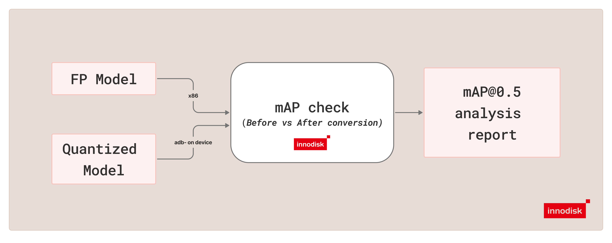

# mAP Mode

`mAP` mode compares a reference YOLO `.pt` model against a converted LiteRT or ONNX counterpart
and reports the `mAP@0.5` difference between the two. Use this mode to validate whether the
converted model preserves the expected detection quality before moving to broader testing or
deployment.



> [!IMPORTANT]
> Recommended host flow: run `./docker/iqf run mAP ...`. If you repeat this workflow, save the
> required host paths first with
> `./docker/iqf configure mAP --type <type> --runtime <runtime> --precision <precision>`. Saved
> paths live in `.iqf/docker-paths.json`.

> [!TIP]
> For detailed mode help, run `./docker/iqf run mAP --help`.

## Supported Runtime and Precision Matrix

| Runtime | Precision | Converted model format |
| --- | --- | --- |
| `litert` | `int8` | `.tflite` |
| `litert` | `fp32` | `.tflite` |
| `onnx` | `fp32` | `.onnx` or compatible `.onnx.zip` bundle |
| `onnx` | `w8a16` | `.onnx` or compatible `.onnx.zip` bundle |

For host setup, start from [README.md](../README.md) and choose either
[Ubuntu_host.md](../Ubuntu_host.md) or [Windows_host.md](../Windows_host.md).

## Representative Commands

LiteRT FP32:

```bash
./docker/iqf run mAP \
  --type yolov26 \
  --runtime litert \
  --precision fp32 \
  --annotations /path/to/instances_val2017.json \
  --images /path/to/val2017 \
  --reference-model /path/to/yolov26n.pt \
  --converted-model /path/to/yolov26_litert_fp32.tflite
```

ONNX Runtime FP32:

```bash
./docker/iqf run mAP \
  --type yolov26 \
  --runtime onnx \
  --precision fp32 \
  --annotations /path/to/instances_val2017.json \
  --images /path/to/val2017 \
  --reference-model /path/to/yolov26n.pt \
  --converted-model /path/to/yolov26_onnx_fp32.onnx
```

For a smaller validation run, limit the number of images:

```bash
./docker/iqf run mAP \
  --type yolov26 \
  --runtime onnx \
  --precision w8a16 \
  --annotations /path/to/instances_val2017.json \
  --images /path/to/val2017 \
  --reference-model /path/to/yolov26n.pt \
  --converted-model /path/to/yolov26_onnx_w8a16.onnx \
  --max-images 5
```

## Purpose

`mAP` mode is used to answer one question: how much model quality changed after the converted
model was produced.

In the current implementation:

- the reference model runs on the host
- the converted model runs on EXMP-Q911 (Qualcomm QCS9075) through ADB-managed execution
- the tool evaluates both outputs with the same dataset, postprocess thresholds, and `mAP@0.5` metric
- the final report shows reference `mAP`, converted `mAP`, absolute delta, percentage delta, and the trend

## Required Inputs

`mAP` requires the following inputs:

- the wrapper subcommand `./docker/iqf run mAP`
- `--type` with one of `yolov10`, `yolov11`, or `yolov26`
- `--runtime` with one of `litert` or `onnx`
- `--precision` with one of `fp32`, `int8`, or `w8a16`
- `--annotations` pointing to either a COCO annotations JSON file or a custom annotation directory
- `--images` pointing to the matching image directory
- `--reference-model` pointing to the reference `.pt` model
- `--converted-model` pointing to the converted model:
  - LiteRT: `.tflite`
  - ONNX Runtime: `.onnx` or compatible `.onnx.zip`

When you use the wrapper, pass the path flags directly or save them first through
`./docker/iqf configure mAP --type <type> --runtime <runtime> --precision <precision>`.

## Output

By default, `mAP` writes the text report to:

```text
out/mAP_results/<type>/<type>_mAP_result_<runtime>_<precision>_<timestamp>.txt
```

Use `--output_text` to override the default location.

## How mAP Mode Works

The current `mAP` pipeline works as follows:

1. Validate the dataset, reference model, converted model, and selected runtime/precision pair.
2. Resolve the annotation source. COCO JSON is used directly; custom `.txt` or `.xml` labels are normalized into a temporary COCO JSON first.
3. Build category mapping from reference model class names to COCO category ids.
4. Resolve the reference output head and evaluation thresholds.
5. Prepare the target runtime, remote runner, and ADB-managed Python environment.
6. Run reference inference on the host and converted-model inference on EXMP-Q911 (Qualcomm QCS9075) with the same evaluation images.
7. Postprocess both outputs with the same settings and evaluate them with `mAP@0.5`.
8. Write a summary report with reference `mAP`, converted `mAP`, and the resulting deltas.

## Custom Annotation Auto-Detection

When `--annotations` points to a directory, `mAP` auto-detects the label format:

- `.txt` files only: treat the directory as YOLO text annotations
- `.xml` files only: treat the directory as VOC XML annotations
- both `.txt` and `.xml`: prefer `.txt` and print a warning that `.xml` was ignored

For custom datasets, reference model class names are the source of truth for category mapping:

- COCO categories are matched to reference model classes by category name, not by sorted category id
- non-contiguous or reordered COCO category ids are supported
- annotation categories may be a subset of the reference model classes
- predictions for classes that are not present in the annotation set are skipped during evaluation
- YOLO `.txt` class ids must still align with the reference model class indices
- VOC XML `<name>` labels must exactly match the reference model class names

The converted model must still match the reference model class count exactly.

`--yaml` is not used by `mAP` for custom datasets.

## Default Reference Output Head

The reference output head is selected from `--type` unless you override it with `--fp-head`.

| `--type` | Default reference output head |
| --- | --- |
| `yolov10` | `one2many` |
| `yolov11` | `default` |
| `yolov26` | `one2many` |

For `yolov10` and `yolov26`, if the converted model was generated with `--qc-head one2one`, run
`mAP` with `--fp-head one2one` so the reference branch matches the converted model. `yolov11`
always uses its default head and ignores `--fp-head`.

## Full mAP Flags

| Flag | Purpose | Default |
| --- | --- | --- |
| `--type` | Select the model family. | Required |
| `--runtime` | Select the deployment runtime. | Required |
| `--precision` | Select the deployment precision. | Required |
| `--annotations` | Path to a COCO annotations JSON file or a custom annotation directory. | Required |
| `--images` | Path to the image directory referenced by the annotations file. | Required |
| `--reference-model` | Path to the reference `.pt` model used as the quality baseline. | Required |
| `--converted-model` | Path to the converted `.tflite`, `.onnx`, or compatible `.onnx.zip` model. | Required |
| `--output_text` | Path for the text report. | `out/mAP_results/<type>/<type>_mAP_result_<runtime>_<precision>_<timestamp>.txt` |
| `--conf` | Pre-NMS confidence threshold used during postprocess for both the reference and converted model paths. | `0.25` |
| `--fp-head` | Reference output branch override for `yolov10` and `yolov26`; use `one2one` when the converted model was created with `--qc-head one2one`. `yolov11` always uses `default`. | `one2many` for `yolov10` and `yolov26`, `default` for `yolov11` |
| `--nms` | NMS IoU threshold used during postprocess for both the reference and converted model paths. | `0.7` |
| `--max-det` | Maximum detections kept per image for both the reference and converted model paths. | `300` |
| `--max-images` | Number of images to evaluate across the entire run. | `300` |
| `--adb-serial` | ADB device serial for the target device. | first available device |
| `--remote-workdir` | Remote working directory on the target. | `/data/local/tmp/yolo_map_eval` |
| `--remote-runner-local` | Local path to the remote runner script. | LiteRT default: `tool/remote_tflite_raw_runner.py`; ONNX effective default: `tool/onnx_inference.py` |
| `--remote-runner-remote` | Target path where the remote runner is pushed. | LiteRT default: `/data/local/tmp/yolo_map_eval/remote_tflite_raw_runner.py`; ONNX effective default: `/data/local/tmp/yolo_map_eval/onnx_inference.py` |
| `--qnn-lib` | LiteRT delegate library path or ONNX Runtime QNN backend path. | LiteRT: `/usr/lib/libQnnTFLiteDelegate.so`; ONNX effective default: `libQnnHtp.so` |
| `--backend` | Delegate backend. Ignored by ONNX Runtime paths. | `htp` |
| `--no-qnn` | Disable the LiteRT QNN delegate or ONNX Runtime QNN EP and use the CPU path instead. | off |


## Notes

- `mAP` uses `--reference-model` and `--converted-model`. The old `--fp-model` and `--int-model` flags are deprecated and rejected.
- ONNX Runtime candidate paths accept `.onnx` and compatible `.onnx.zip` bundles. Bundles are extracted automatically before evaluation.
- It is recommended to start with the default settings. For `yolov10` and `yolov26`, if the converted model was produced with `--qc-head one2one`, update `--fp-head` to `one2one` so the reference path matches the converted model.
