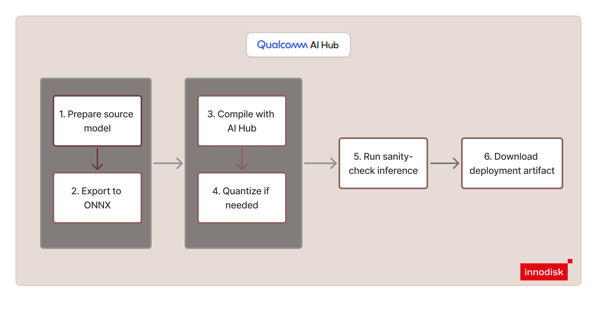

# Convert Other Vision Models with Qualcomm AI Hub Workbench

This guide is for users who have a vision model that is **not directly supported by iQ-Foundry**.

Currently, iQ-Foundry has direct flows for:

- YOLOv10
- YOLOv11
- YOLOv26

For other vision models, use **Qualcomm AI Hub Workbench** to convert and validate the model
before integrating it into your application flow.

> [!IMPORTANT]
> This is a flow guide, not an end-to-end tutorial. The exact export, pre-processing,
> post-processing, and validation steps depend on your model.

> [!NOTE]
> This workflow is based on our practical integration experience and recommended usage patterns. For
> more details please visit [Qualcomm AI Hub workbench documentations](https://workbench.aihub.qualcomm.com/docs/).

---

## High-Level Workflow



---

## Goal

Use Qualcomm AI Hub Workbench to move a custom vision model through this flow:

```text
source model
  -> ONNX export
  -> AI Hub compile / quantize / inference
  -> final deployment artifact
```

Target:

| Item | Value |
| --- | --- |
| Target device | Dragonwing IQ-9075 EVK |
| Typical runtime path | TFLite |
| Model type | Classification, detection, or segmentation |

---

## When to Use This Guide

Use this guide for models such as:

- image classification models
- object detection models
- semantic segmentation models
- instance segmentation models
- YOLO models not currently supported by iQ-Foundry
- custom PyTorch or ONNX vision models

Do not force an unsupported model into the existing iQ-Foundry YOLOv10 / YOLOv11 / YOLOv26 flow.

---
## Step 1: Install and Log In to Qualcomm AI Hub

```bash
pip install qai-hub
```

```bash
qai-hub configure --api_token <YOUR_QAI_HUB_TOKEN>
```

You can verify the CLI is available with:

```bash
qai-hub --help
```

---

## Step 2: Select the Target Device

Use the AI Hub device:

```text
Dragonwing IQ-9075 EVK
```

You can inspect the available devices with:

```bash
qai-hub list-devices
```

In the API snippets below, use that device name when creating `hub.Device(...)`.

---

## Step 3: Export to ONNX and Validate Locally

Before using AI Hub:

- export your source model to ONNX
- run a local sanity check
- confirm the model inputs and outputs are what you expect

If the ONNX export is not stable, fix that first before moving to AI Hub.

---

## Step 4: Compile a Baseline Model

Start with a simple compile flow to confirm the model can be accepted by AI Hub.

Example API invocation:

```python
import qai_hub as hub

job = hub.submit_compile_job(
    model="path/to/model.onnx",
    device=hub.Device("Dragonwing IQ-9075 EVK"),
    input_specs=<model_specific_input_specs>,
    options="--target_runtime tflite",
)

job.download_target_model("path/to/output/model.tflite")
```

At this stage, the goal is not deep optimization. The goal is to confirm that the model can be
compiled and downloaded successfully.

---

## Step 5: Quantize if Needed

If your deployment plan requires quantization, prepare calibration data that matches the real
model input pipeline as closely as possible.

Example API invocation:

```python
import qai_hub as hub

quantize_job = hub.submit_quantize_job(
    model=<compiled_or_optimized_model>,
    calibration_data=<model_specific_calibration_data>,
    weights_dtype=hub.QuantizeDtype.INT8,
    activations_dtype=hub.QuantizeDtype.INT8,
)

quantized_model = quantize_job.get_target_model()
```

Then compile the quantized model:

```python
import qai_hub as hub

compile_job = hub.submit_compile_job(
    model=quantized_model,
    device=hub.Device("Dragonwing IQ-9075 EVK"),
    options="--target_runtime tflite",
)
```

If quantization quality is not acceptable, revisit calibration data and model-specific
pre-processing before continuing.

---

## Step 6: Run a Sanity-Check Inference

Use AI Hub inference to confirm the compiled model produces outputs with the expected structure.

Example API invocation:

```python
import qai_hub as hub

inference_job = hub.submit_inference_job(
    model="path/to/compiled/model.tflite",
    device=hub.Device("Dragonwing IQ-9075 EVK"),
    inputs=<model_specific_inputs>,
)
```

Check:

- whether inference completes successfully
- whether output tensors look structurally correct
- whether the outputs still match your application expectations

---

## Step 7: Download and Integrate

After the model is compiled and validated, download the final artifact and integrate it into your
own application flow.

At that point, your application must still handle:

- image loading
- pre-processing
- tensor formatting
- inference invocation
- output parsing
- post-processing
- result visualization or downstream logic

AI Hub gives you the optimized model artifact. It does not automatically provide the full
application logic for your custom model.

---

## Common Problems

| Problem | What to check |
| --- | --- |
| Compile fails | ONNX export, unsupported operators, dynamic behavior |
| Quantized quality drops too much | Calibration data and pre-processing |
| Output tensors look wrong | Input specs, layout, output interpretation |
| Detection results are wrong | Resize, normalization, box decoding, NMS |
| Segmentation results are wrong | Mask resize, output interpretation, upsampling |

---

## Simple Checklist

Before deployment, confirm:

- [ ] ONNX export works
- [ ] ONNX outputs are validated locally
- [ ] AI Hub compile works
- [ ] calibration data is prepared if quantization is needed
- [ ] AI Hub inference works
- [ ] outputs are compared against the original model behavior
- [ ] pre-processing is documented
- [ ] post-processing is documented
- [ ] final deployment artifact is downloaded

---

## Very Short Summary

For unsupported vision models:

```text
Export to ONNX
  -> Validate locally
  -> Compile with AI Hub
  -> Quantize if needed
  -> Run sanity-check inference
  -> Download final artifact
  -> Integrate into your application
```

Use the built-in iQ-Foundry flow for directly supported models.

Use Qualcomm AI Hub Workbench for other custom classification, detection, and segmentation models.

---

## Useful Links & References

- Qualcomm AI Hub Workbench documentation: https://workbench.aihub.qualcomm.com/docs/
- Compile examples: https://workbench.aihub.qualcomm.com/docs/hub/compile_examples.html
- Quantization examples: https://workbench.aihub.qualcomm.com/docs/hub/quantize_examples.html
- Inference examples: https://workbench.aihub.qualcomm.com/docs/hub/inference_examples.html

---
