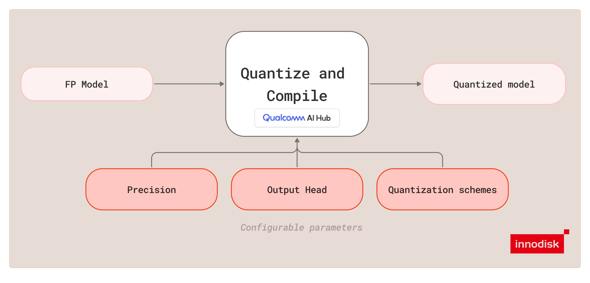

# QC Mode

`qc` mode prepares a supported YOLO `.pt` model for deployment by converting it into a runtime-
specific artifact through QAI Hub. Depending on `--runtime` and `--precision`, the output is a
LiteRT `.tflite` model or an ONNX `.onnx` model for EXMP-Q911 (Qualcomm QCS9075).



> [!IMPORTANT]
> Recommended host flow: run `./docker/iqf run qc ...`. If you repeat this workflow, save the
> required host paths first with
> `./docker/iqf configure qc --type <type> --runtime <runtime> --precision <precision>`. Saved
> paths live in `.iqf/docker-paths.json`.

> [!TIP]
> For detailed mode help, run `./docker/iqf run qc --help`.

## Supported Runtime and Precision Matrix

| Runtime | Precision | Output | Calibration |
| --- | --- | --- | --- |
| `litert` | `int8` | `.tflite` | Required |
| `litert` | `fp32` | `.tflite` | Ignored |
| `onnx` | `fp32` | `.onnx` | Ignored |
| `onnx` | `w8a16` | `.onnx` | Required |

For host setup, start from [README.md](../README.md) and choose either
[Ubuntu_host.md](../Ubuntu_host.md) or [Windows_host.md](../Windows_host.md).

## Representative Commands

LiteRT INT8:

```bash
./docker/iqf run qc \
  --type yolov26 \
  --runtime litert \
  --precision int8 \
  --model /path/to/yolov26n.pt \
  --calib_dir /path/to/calibration_images
```

LiteRT FP32:

```bash
./docker/iqf run qc \
  --type yolov26 \
  --runtime litert \
  --precision fp32 \
  --model /path/to/yolov26n.pt
```

ONNX Runtime FP32:

```bash
./docker/iqf run qc \
  --type yolov26 \
  --runtime onnx \
  --precision fp32 \
  --model /path/to/yolov26n.pt
```

ONNX Runtime W8A16:

```bash
./docker/iqf run qc \
  --type yolov26 \
  --runtime onnx \
  --precision w8a16 \
  --model /path/to/yolov26n.pt \
  --calib_dir /path/to/calibration_images
```

## Required Inputs

`qc` requires the following:

- the wrapper subcommand `./docker/iqf run qc`
- `--type` with one of `yolov10`, `yolov11`, or `yolov26`
- `--runtime` with one of `litert` or `onnx`
- `--precision` with one of `fp32`, `int8`, or `w8a16`
- `--model` pointing to a supported FP `.pt` model
- `--calib_dir` only for `litert/int8` and `onnx/w8a16`

When you use the wrapper, pass the path flags directly or save them first through
`./docker/iqf configure qc --type <type> --runtime <runtime> --precision <precision>`.

For `litert/fp32` and `onnx/fp32`, calibration is not part of the required UX:

- `--calib_dir` is optional and ignored if supplied
- `--max_calib` is ignored if supplied
- `--qc-quant-scheme` is ignored if supplied

## Output

By default, `qc` writes the generated artifact to:

```text
out/model/<type>/<type>_<runtime>_<precision>_<timestamp>.<tflite|onnx>
```

Examples:

- `out/model/yolov26/yolov26_litert_int8_<timestamp>.tflite`
- `out/model/yolov26/yolov26_litert_fp32_<timestamp>.tflite`
- `out/model/yolov26/yolov26_onnx_fp32_<timestamp>.onnx`
- `out/model/yolov26/yolov26_onnx_w8a16_<timestamp>.onnx`

Use `--output` to override the default location.

## How QC Mode Works

`qc` mode runs the following high-level flow:

1. Validate the selected `--runtime` and `--precision` combination.
2. Validate the required inputs for that combination.
3. Resolve the effective export head, quantization scheme, and output path for the selected model type.
4. Run the matching QAI Hub pipeline for LiteRT INT8, LiteRT FP32, ONNX FP32, or ONNX W8A16.
5. Download the generated artifact to the resolved output path.

For ONNX outputs, if QAI Hub returns a bundled ONNX artifact, iQ-Foundry extracts the public
`.onnx` entrypoint and keeps any required sidecar data next to it.

## Flags, Defaults, and Options

| Flag | Purpose | Options | Default |
| --- | --- | --- | --- |
| `--type` | Select the model family. | `yolov10`, `yolov11`, `yolov26` | Required |
| `--runtime` | Select the deployment runtime. | `litert`, `onnx` | Required |
| `--precision` | Select the deployment precision. | `fp32`, `int8`, `w8a16` | Required |
| `--model` | Path to the FP `.pt` model. | filesystem path | Required |
| `--calib_dir` | Calibration image directory. Required for `litert/int8` and `onnx/w8a16`; ignored for FP32 flows. | filesystem path | runtime-dependent |
| `--output` | Override the output model path. | filesystem path | `out/model/<type>/<type>_<runtime>_<precision>_<timestamp>.<tflite|onnx>` |
| `--max_calib` | Maximum calibration images used for quantized conversion. Ignored for FP32 flows. | integer | `200` |
| `--qc-head` | Override the export head for supported models. | `one2many`, `one2one` | `one2many` for `yolov10` and `yolov26`; ignored for `yolov11`, which uses `default` |
| `--qc-quant-scheme` | Override the quantization scheme for quantized conversion. Ignored for FP32 flows. | `mse`, `minmax` | `mse` for `yolov10`, `minmax` for `yolov11`, `mse` for `yolov26` |


## Notes

- `litert/fp32` and `onnx/fp32` do not require calibration data in configure flow or one-shot usage.
- `yolov11` always uses its default export head and ignores `--qc-head`.
- For `yolov10` and `yolov26`, keep `--qc-head` aligned with the branch you intend to evaluate later in `mAP`.
- Saved wrapper paths are scoped by `type`, `mode`, `runtime`, and `precision`, so LiteRT and ONNX entries do not overwrite each other.
