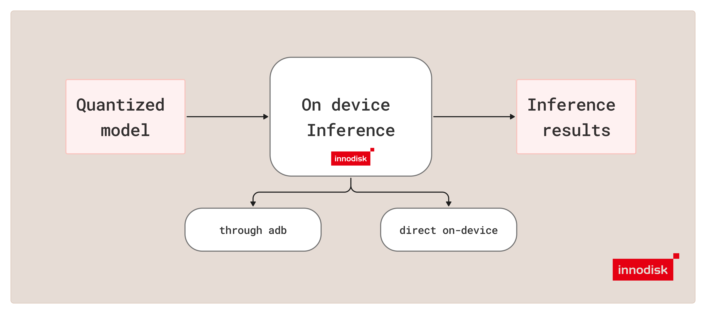

# Test Mode

`test` mode runs a converted LiteRT or ONNX model on sample images and writes visual plus text
outputs for quick inspection. Use this mode after model conversion and quality validation to
confirm that detections look correct on real input images and that on-device behavior matches
expectations.



> [!IMPORTANT]
> Recommended host flow: run `./docker/iqf run test ... --adb` from your Ubuntu host or WSL
> terminal. If you repeat this workflow, save the required host paths first with
> `./docker/iqf configure test --type <type> --runtime <runtime> --precision <precision>`. Saved
> paths live in `.iqf/docker-paths.json`.

> [!TIP]
> For detailed mode help, run `./docker/iqf run test --help`.

## Purpose

`test` mode is the final quick-check stage in this repository workflow.

It is used to:

- run a converted model on sample images
- verify that the selected `--type`, `--runtime`, and `--precision` match the prepared model
- inspect annotated outputs and detection text files
- confirm practical on-device behavior after `qc` and, if needed, after `mAP`

## Supported Runtime and Precision Matrix

| Runtime | Precision | Converted model format |
| --- | --- | --- |
| `litert` | `int8` | `.tflite` |
| `litert` | `fp32` | `.tflite` |
| `onnx` | `fp32` | `.onnx` or compatible `.onnx.zip` bundle |
| `onnx` | `w8a16` | `.onnx` or compatible `.onnx.zip` bundle |

For host setup, start from [README.md](../README.md) and choose either
[Ubuntu_host.md](../Ubuntu_host.md) or [Windows_host.md](../Windows_host.md).

## Representative Commands

LiteRT FP32 over ADB:

```bash
./docker/iqf run test \
  --type yolov26 \
  --runtime litert \
  --precision fp32 \
  --model /path/to/yolov26_litert_fp32.tflite \
  --yaml /path/to/coco.yaml \
  --images /path/to/test_images \
  --adb
```

ONNX Runtime FP32 over ADB:

```bash
./docker/iqf run test \
  --type yolov26 \
  --runtime onnx \
  --precision fp32 \
  --model /path/to/yolov26_onnx_fp32.onnx \
  --yaml /path/to/coco.yaml \
  --images /path/to/test_images \
  --adb
```

ONNX Runtime W8A16 over ADB:

```bash
./docker/iqf run test \
  --type yolov26 \
  --runtime onnx \
  --precision w8a16 \
  --model /path/to/yolov26_onnx_w8a16.onnx \
  --yaml /path/to/coco.yaml \
  --images /path/to/test_images \
  --adb
```

## How Test Mode Works

The current `test` pipeline works as follows:

1. Validate the converted model path, class-name YAML file, and image input.
2. Validate the selected `--runtime` and `--precision` combination.
3. Resolve the effective postprocess settings from the selected model type and any CLI overrides.
4. If the ONNX input is a compatible `.onnx.zip` bundle, extract the `.onnx` entrypoint and any required sidecar data before execution.
5. Run inference on EXMP-Q911 (Qualcomm QCS9075), either through ADB from the host or directly on the device.
6. Postprocess the raw outputs and write annotated images, detection `.txt` files, and `classes.txt`.

## ADB Mode vs Direct On-Device Mode

`test` mode supports two execution paths.

### ADB Mode

Use ADB mode when you are running the command from the host and want the tool to push files,
execute inference on EXMP-Q911 (Qualcomm QCS9075), and pull the results back automatically.

In ADB mode, the tool:

- prepares a temporary run directory on the target
- pushes the model, YAML file, runtime-appropriate inference runner, and input images to EXMP-Q911
- runs inference remotely
- pulls the generated outputs back to the host output directory

Runtime-specific behavior:

- LiteRT paths use `tool/inference_tflite.py`
- ONNX Runtime paths use `tool/onnx_inference.py`
- ONNX Runtime ADB paths ensure `onnxruntime_qnn` is installed in `/etc/innodisk/iq-qnn/.venv`
  and require the imported `onnxruntime` module to resolve from that venv

### Direct On-Device Mode

Use direct on-device mode when you are logged into EXMP-Q911 (Qualcomm QCS9075) and want to run
the command locally on the target without `--adb`.

#### Prerequisites

- copy or clone this repository onto EXMP-Q911
- install [uv](https://docs.astral.sh/uv/) on the target if it is not already available
- install the target dependencies from `requirements/target.txt`
- for ONNX Runtime paths, manually install the required `onnxruntime_qnn` wheel from the repo
  `wheels/` directory into the device venv

#### Target Setup

```bash
git clone https://github.com/InnoIPA/iQ-Foundry.git
cd iQ-Foundry
```

```bash
curl -LsSf https://astral.sh/uv/install.sh | sh
uv venv --system-site-packages .venv
source .venv/bin/activate
uv pip install -r requirements/target.txt
```

For direct ONNX Runtime execution on the device, install the wheel from `wheels/`:

```bash
uv pip install wheels/onnxruntime_qnn-1.23.0-cp312-cp312-linux_aarch64.whl
```

Sample direct command:

```bash
python3 cli.py \
  --mode test \
  --type yolov26 \
  --runtime litert \
  --precision fp32 \
  --model /path/to/yolov26_litert_fp32.tflite \
  --yaml /path/to/coco.yaml \
  --images /path/to/test_images
```

In direct on-device mode:

- the command must run on EXMP-Q911 itself
- `--adb` is not used
- the repository and target dependencies must already be installed on the device

## Required Inputs

`test` requires the following:

- the wrapper subcommand `./docker/iqf run test`
- `--type` with one of `yolov10`, `yolov11`, or `yolov26`
- `--runtime` with one of `litert` or `onnx`
- `--precision` with one of `fp32`, `int8`, or `w8a16`
- `--model` pointing to the converted model:
  - LiteRT: `.tflite`
  - ONNX Runtime: `.onnx` or compatible `.onnx.zip`
- `--yaml` pointing to the class-name YAML file
- exactly one of:
  - `--images`
  - `--image`

When you use the wrapper, pass the path flags directly or save them first through
`./docker/iqf configure test --type <type> --runtime <runtime> --precision <precision>`.

## Output

By default, `test` writes results to:

```text
out/test/<type>/<type>_inference_<runtime>_<precision>_<timestamp>/
```

The output directory contains:

- annotated images
- detection `.txt` files
- `classes.txt`

Use `--output` to override the default location.

## Default Settings by Model

| `--type` | Default flow | Default `--conf` | Default `--nms` | Default `--topk` | Default `--max-det` |
| --- | --- | --- | --- | --- | --- |
| `yolov10` | `o2m` | `0.25` | `0.6` | `300` | `100` |
| `yolov11` | `default` | `0.25` | `0.6` | `300` | `100` |
| `yolov26` | `o2m` | `0.25` | `0.6` | `300` | `100` |

These defaults are shared across LiteRT and ONNX Runtime paths.

## Flags, Defaults, and Options

| Flag | Purpose | Options | Default |
| --- | --- | --- | --- |
| `--type` | Select the model family. | `yolov10`, `yolov11`, `yolov26` | Required |
| `--runtime` | Select the deployment runtime. | `litert`, `onnx` | Required |
| `--precision` | Select the deployment precision. | `fp32`, `int8`, `w8a16` | Required |
| `--model` | Path to the converted model. | `.tflite`, `.onnx`, `.onnx.zip` | Required |
| `--yaml` | Path to the class-name YAML file. | filesystem path | Required |
| `--images` | Directory of input images. | filesystem path | Required unless `--image` is used |
| `--image` | Single input image. | filesystem path | Required unless `--images` is used |
| `--adb` | Run inference on EXMP-Q911 (Qualcomm QCS9075) through ADB from the host. | enabled or omitted | off |
| `--output` | Override the output directory. | filesystem path | `out/test/<type>/<type>_inference_<runtime>_<precision>_<timestamp>/` |
| `--conf` | Confidence threshold used in postprocess. | float | model default |
| `--nms` | NMS IoU threshold used in postprocess. | float | model default |
| `--topk` | Number of candidates kept before NMS. | integer | model default |
| `--max-det` | Maximum detections kept per image. | integer | model default |
| `--postprocess-flow` | Override the postprocess flow. | `auto`, `default`, `o2o`, `o2m` | `auto` |
| `--o2o-nms` | Enable class-wise NMS when using `o2o`. | enabled or omitted | off |
| `--disable-int8-prefilter` | Disable the INT8 class prefilter in postprocess. Meaningful only for LiteRT INT8; ignored by LiteRT FP32 and ONNX Runtime. | enabled or omitted | off |
| `--adb-serial` | Select a specific ADB target device. | ADB serial string | first available ADB target |
| `--remote-workdir` | Remote working directory used in ADB mode. | filesystem path on target | `/data/local/tmp/yolo_test` |
| `--qnn-lib` | LiteRT delegate library path or ONNX Runtime QNN backend path. | filesystem path on target or backend library name | LiteRT: `/usr/lib/libQnnTFLiteDelegate.so`; ONNX effective default: `libQnnHtp.so` |
| `--backend` | Delegate backend. Ignored by ONNX Runtime paths. | string | `htp` |
| `--no-qnn` | Disable the LiteRT QNN delegate or ONNX Runtime QNN EP and use the CPU path instead. | enabled or omitted | off |

## Notes

- `yolov11` supports only the default postprocess flow. If `o2o` or `o2m` is requested, the current implementation ignores it and uses `default`.
- `--o2o-nms` is meaningful only when the active flow is `o2o`.
- Host-side `test` uses containerized ADB through `./docker/iqf`.
- Direct on-device `test` runs on EXMP-Q911 itself and continues to use `cli.py`.
- It is recommended to start with the default settings and only change postprocess flags when debugging unexpected detection behavior.
